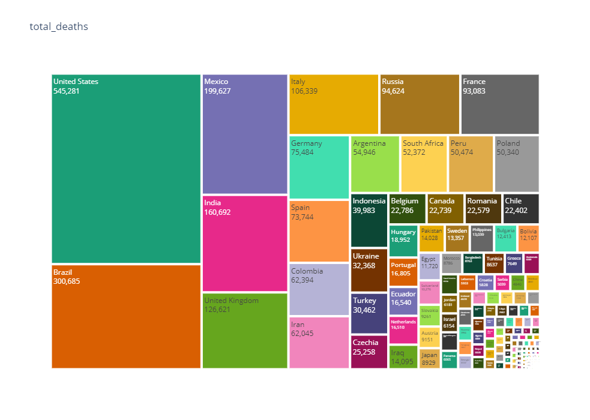

### Data-Scientist-Nanodegree-Program
By Marwan Saeed Alsharabbi
## COVID-19 Analysis ,visualization & Prediction
### Table of Contents
=================
  * [Data Scientist Capstone](#data-Scientist-Capstone)
      + [Project Definition](#Project-Definition)
        - [Project Overview](#Project-Overview)
        - [Problem Statement](#Problem-Statement)
        - [Metrics](#Metrics)
      + [Analysis](#Analysis)
        - [Data Exploration](#Data-Exploration)
        - [Data Visualization](#Data-Visualization)
        - [Questions](#Questions)
      + [Methodology](#Methodology)
        - [Data Preprocessing](#Data-Preprocessing)
        - [Implementation](#Implementation)
     + [Results](#Results)
       - [Model Evaluation and Validation](#Model-Evaluation-and-Validation)
       - [Justification](#Justification)
     + [Conclusion](#Conclusion)
     + [Deliverables](#fDeliverables)
       - [Write A COVID-19 Analysis Blog Post](#Write-A-COVID-19-Analysis-Blog-Post)
       - [References](#References)
  

## Data Scientist Capstone

## Project Definition

### Project-Overview
Coronavirus is a family of viruses that are named after their spiky crown. The novel coronavirus, also known as SARS-CoV-2, is a contagious respiratory virus that first reported in Wuhan, China. On 2/11/2020, the World Health Organization designated the name COVID-19 for the disease caused by the novel coronavirus. This notebook aims at exploring COVID-19 through data analysis and projections.
The world is going through a difficult time and fighting with a deadly virus called COVID-19. Coronavirus disease 2019 (COVID-19) is an infectious disease caused by severe acute respiratory syndrome coronavirus 2 (SARS-CoV-2). It was first identified in December 2019 in Wuhan, China, and has resulted in an ongoing pandemic. The first case may be traced back to 17 November 2019.As of 8 June 2020, more than 7.06 million cases have been reported across 188 countries and territories, resulting in more than 403,000 deaths. More than 3.16 million people have recovered.

### Select a real-world dataset 

I chose the Covid 19 data set from the following site(https://ourworldindata.org/coronavirus), and I will analyze the data, clean and perform some interesting processes and conclusions. I will strengthen the analysis and cleaning of global data. 
The data was downloaded from https://covid.ourworldindata.org/data/owid-covid-data.csv.

### Data Sources:

Confirmed cases and deaths: Data comes from the European Centre for Disease Prevention and Control (ECDC)
Testing for COVID-19: Data is collected by the Our World in Data team from official reports; you can find the source information for every country and further details in the post on COVID-19 testing. The testing dataset is updated around twice a week.
Confirmed cases and deaths: Data is collected from a variety of sources (United Nations, World Bank, Global Burden of Disease, etc.)

### License:
The information on this page is summarized from OWID's COVID-19 github page. All of Our World in Data is completely open access and all work is licensed under the Creative Commons BY license. More information about the usage of content can be found OWID github page.https://github.com/owid/covid-19-data/tree/master/public/data

### Authors:
OWID's COVID19 github page the data has been collected, aggregated, and documented by Diana Beltekian, Daniel Gavrilov, Joe Hasell, Bobbie Macdonald, Edouard Mathieu, Esteban Ortiz-Ospina, Hannah Ritchie, Max Roser.

## Load packages Prerequisites
* Numpy
* Pandas
* seaborn
* Matplotlib
* math
* IPython import display
* xgboost
* sklearn
* plotly
* datetime
* scipy
* zscore

## Problem Statement

### 1- Created a Linear regression-Forecast model : 

Created a Linear regression model and fit the model with owid COVID19 data, predicted the world death projection for the next 30 days. In this project I have used sklearn for creating Linear Regression model and created training split with 80 to 20%. The trained the model and predicted the death for next 30 days. Also created model using XGBoost for improving the linear regression model and fit the model with owid COVID19 data, predicted the world death projection for the next 30 days.

### 2- Create a model that can predict the risk of mortality for people over 65 years of age and over using KNN:
I will create a model that can predict the risk for the Case Mortality Ratio of a Country utilizing its Life Expectancy, Percentage of Population over 65, and Percentage of diabetes_prevalence and cardiovasc_death_rate ?

It decided on using Population Over Age 65 and Obesity because in the world, over 80% of the deaths were in the population 65 and over, and the CDC has stated that 94% of deaths had some underlying health condition. We also used Life Expectency per country to account for possible deficiencies in the health care system. John Hopkins University has listed several diseases such as heart disease and Diabetes which are known to be exacerbated by Obesity. Our idea is that we can more accurately predict the Mortality Ratio of COVID-19 by using both population 65 and over and Obesity rather than just population 65 and over. This may show that creating a healthier population is the best way to prevent the devastation in future pandemics that the world is currently facing

## Metrics

- There are several ways to check your Linear Regression model accuracy. Usually, you may use Root mean squared error. You may train several Linear Regression models, adding or removing features to your dataset, and see which one has the lowest RMSE - the best one in the case I will use accuracy to gauge the performance of the model  
-  Linear Regression Fitted with Accuracy of accuracy = lr.score(X_test, y_test)
-  Accuracy: One of the more obvious metrics, it is the measure of all the correctly identified cases. It is most used when all the classes are equally important
-  In multilabel classification, this function computes subset accuracy: the set of labels predicted for a sample must exactly match the corresponding set of labels in y_true.
- Accuracy is the most intuitive performance measure, and defined as the ratio of the number of correctly classified objects to the total number of objects evaluated.
- In the k-nearest neighbors(KNN) algorithm I will use accuracy
-  accuracy = (predictions == y_test).mean() first checks if all the values in y_test is equal to corresponding values in predictions which either results in 0 or 1. And then takes the mean of it (which is still 0 or 1).

## Analysis

### Data Exploration

#### Data and variables
For the analysis and Machine Learning I have used The complete _Our World in Data_ COVID-19 dataset

**Our complete COVID-19 dataset is available in [CSV](https://covid.ourworldindata.org/data/owid-covid-data.csv), [XLSX](https://covid.ourworldindata.org/data/owid-covid-data.xlsx), and [JSON](https://covid.ourworldindata.org/data/owid-covid-data.json) formats, and includes all of our historical data on the pandemic up to the date of publication.**

The CSV and XLSX files follow a format of 1 row per location and date. The JSON version is split by country ISO code, with static variables and an array of daily records.

The variables represent all of our main data related to confirmed cases, deaths, hospitalizations, and testing, as well as other variables of potential interest.

As of 26 January 2021, the columns are: `iso_code`, `continent`, `location`, `date`, `total_cases`, `new_cases`, `new_cases_smoothed`, `total_deaths`, `new_deaths`, `new_deaths_smoothed`, `total_cases_per_million`, `new_cases_per_million`, `new_cases_smoothed_per_million`, `total_deaths_per_million`, `new_deaths_per_million`, `new_deaths_smoothed_per_million`, `reproduction_rate`, `icu_patients`, `icu_patients_per_million`, `hosp_patients`, `hosp_patients_per_million`, `weekly_icu_admissions`, `weekly_icu_admissions_per_million`, `weekly_hosp_admissions`, `weekly_hosp_admissions_per_million`, `total_tests`, `new_tests`, `total_tests_per_thousand`, `new_tests_per_thousand`, `new_tests_smoothed`, `new_tests_smoothed_per_thousand`, `positive_rate`, `tests_per_case`, `tests_units`, `total_vaccinations`, `people_vaccinated`, `people_fully_vaccinated`, `new_vaccinations`, `new_vaccinations_smoothed`, `total_vaccinations_per_hundred`, `people_vaccinated_per_hundred`, `people_fully_vaccinated_per_hundred`, `new_vaccinations_smoothed_per_million`, `stringency_index`, `population`, `population_density`, `median_age`, `aged_65_older`, `aged_70_older`, `gdp_per_capita`, `extreme_poverty`, `cardiovasc_death_rate`, `diabetes_prevalence`, `female_smokers`, `male_smokers`, `handwashing_facilities`, `hospital_beds_per_thousand`, `life_expectancy`, `human_development_index

A [full codebook](https://github.com/owid/covid-19-data/tree/master/public/data/owid-covid-codebook.csv) is made available, with a description and source for each variable in the dataset.`

 ### missing or faulty value
 
For now, let's assume this was indeed a data entry error. We can use one of the following approaches for dealing with the missing or faulty value:

- Replace it with 0.
- Replace it with the average of the entire column
- Replace it with the average of the values on the previous & next date
- Discard the row entirely
  Which approach you pick requires some context about the data and the problem. In this case, since we are dealing with data ordered by date, we can go ahead with the one approach

   It is not really logical to delete Nan values but replace with 0, because that would confirm that the result was static because the data is historical and adopts high time series, we cannot replace or delete even the most data in the rows because it is data historical 
 
### Data Visualization
 
 For the EDA and Visualization I have used Our World in Data. Based on the research, I decided to use packages like Plotly and seaborn for better visualization, also it needed jupyter extensions to display the graph. I have created couple of plots and maps, created bar plot to display top 15 countries with highest number of death rates created sub bar plots for displaying Top 15 Countries with Confirmed Cases, Top 15 Countries with total_deaths , Top 15 Countries with new Cases, and Top 15 Countries with people_fully_vaccinated and total_vaccinations . Also created a bar chart for comparing confirmed, death and total cases. Created correlation heat map to find out the highly correlated variables. Created Scatter geo map for displaying the trend over the time and created including variables like gdp_per_capita , diabetes_prevalence ,female_smokers, male_smokers, hospital_beds_per_100k, cvd_death_rate. visualizations of the analysis are included in the attached and answer for some questions
 
see the notbook or html file [Capston-dsnd-project-Covid19](https://github.com/marwan1023/Data-Scientist-Nanodegree-Program/blob/master/Capston-dsnd-project-Covid19/Capston-dsnd-project.ipynb)

### Questions

 - How many total population in each location by continents from our dataset?
- The 10 top population total in each location by continents from our dataset?
- Show countries in Asia, Europe and North America the total_cases and total_deaths,new_cases,total_tests, total_vaccinations by mean, and max?
- Let's see the speed of transmission of the Corona virus between countries on the map ?
- Let's see number of total_cases,total_deaths,total_deaths_per_million,test per confirmed(%) on map ?
- Top 15 countries for the total_cases,total_deaths,total_deaths_per_million,total_tests ,people_fully_vaccinated and total_vaccinations on plot_hbar and Visulizing Treemaps?
- How many the New Deaths Smoothed day by day in continents ?
- How many the New Tests Smoothed day by day in continents ?
- How many the positive_rate day by day in continents
- find some gdp_per_capita and new_cases clusters over countries ?
- find some new_deaths_smoothed_per_million, life_expectancy and hospital_beds_per_thousand clusters over countries ?
- find some new_deaths_smoothed_per_million, handwashing_facilities and extreme_poverty clusters over countries ?
- find some new_deaths_smoothed_per_million, life_expectancy and hospital_beds_per_thousand clusters over countries?

 
## Methodology 

### Data Preprocessing
- The preprocessing done in the “Prepare data” from https://ourworldindata.org/coronavirus
- To construct a anlysis capable to make good recommendations, it is necessary to understand how the features influence the desired variable. To make this, I will split my work in tow stages:
#### -  1. Exploring: 
- An exploratory analysis, to understand the structure of data, missing values, correlations and etc, to select the best set of features to be used at the analysis.
- Understand the data and learn categorical numerical features in the dataset
- Let's assume this was indeed a data entry error. We can use one of the following approaches for dealing with the missing or faulty value:
Or the delay in knowing the results due to Covid 19 in some countries and using some measures and statistics and displaying the results to understand the data
- You answered some questions and presented the results with visualization
#### -  2. Modeling: 
- In this step, I try to find the best and simplest model for describing the data
- Created a Linear regression model and fit the model with owid COVID19 data, predicted the world death projection for the next 30 days.using the with independent variable like age, gdp, diabetes, smokers, hospital beds etc
- I will create a model that can predict the risk for the Case Mortality Ratio of a Country utilizing its Life Expectancy, Percentage of Population over 65, and Percentage of diabetes_prevalence and cardiovasc_death_rate ?

### Implementation
The implementation process can be divided into two main stages:
1. The stage of analyzing the data and answering some questions
- It appears that each column contains values of a specific data type. For the numeric columns, you can view the some statistical information like mean, standard deviation, minimum/maximum values and number of non-empty values using the .describe method For some specific continents like Asia, Europe, America and Africa
2. The model training phase: Predictions are presented and the models are calculated in the future. The data was divided into testing and training
 #### Linear Regression-Forecast
 - Linear regression doesn't work on date data. Therefore we need to convert it into index form  for predicting date value in the future
- Linear Regression Model: used to predict future values from past values
- input data Used OneWorld.org data for modeling.
- Predicted the Death rate for next 30 days with independent variable like age, gdp, diabetes, smokers, hospital beds etc.
- Split into 80% train and 20% test data. X_train, X_test, y_train, y_test = train_test_split(X, y, test_size=0.2, random_state=0)
- Linear Regression Fitted with Accuracy of accuracy = lr.score(X_test, y_test)
- Used sklearn.model_selection for train_test_split 
- Used sklearn.linear_model for LinearRegression forecast_prediction = lr.predict(X_forecast_out)
- Predicted the Death rate for next 30 days in the forecast column
#### k-nearest neighbors(KNN) algorithm

Neighbors-based classification is a type of instance-based learning or non-generalizing learning: it does not attempt to construct a general internal model, but simply stores instances of the training data. Classification is computed from a simple majority vote of the nearest neighbors of each point: a query point is assigned the data class which has the most representatives within the nearest neighbors of the point.

- It decided to Create a column the High Risk and base it off of total_deaths_per_million which is the Total deaths attributed to COVID-19 per 1,000,000 people
- Calculate the distance between the data sample and every other sample with the help of a method such as Euclidean.
- Sort these values of distances in ascending order.
- Choose the top K values from the sorted distances.
- Assign the class to the sample based on the most frequent class in the above K values.
- acc = (predictions == y_test).mean() first checks if all the values in y_test is equal to corresponding values in predictions which either results in 0 or 1. And then takes the mean of it (which is still 0 or 1). 

## Results
- How many total population in each location by continents from our dataset? 

 
 
 
 - - Top 15 countries for the total_cases,total_deaths,total_deaths_per_million,total_tests ,people_fully_vaccinated and total_vaccinations on plot_hbar and Visulizing Treemaps?
  #### total_cases
  
  
  
  
 #### total_deaths
 
  
  
  
  
#### total_deaths_per_million

  
  
#### test per confirmed(%)

  
  
#### total_tests

#### total_vaccinations

#### people_fully_vaccinated

- How many the New Deaths Smoothed day by day in continents ?

 
 
- How many the positive_rate day by day in continents

- find some new_deaths_smoothed_per_million, handwashing_facilities and extreme_poverty clusters over countries ?

-  find some new_deaths_smoothed_per_million, life_expectancy and hospital_beds_per_thousand clusters over countries?

### Model Evaluation and Validation

### 1- Linear Regression-Forecast
Created a Linear regression model and fit the model with owid COVID19 data, predicted the world death projection for the next 30 days. In this project I have used sklearn for creating Linear Regression model and created training split with 80 to 20%. The trained the model and predicted the death for next 30 days. Also created model using XGBoost for improving the linear regression model and fit the model with owid COVID19 data, predicted the world death projection for the next 30 day.

 ### Linear Regression Model: used to predict future values from past values
- Used OneWorld.org data for modeling.
- Predicted the Death rate for next 30 days with independent variable like age, gdp, diabetes, smokers, hospital beds etc.
- Split into 80% train and 20% test data.
- Linear Regression Fitted with Accuracy : 0.9976567640125802
- Used sklearn.model_selection for train_test_split
- Used sklearn.linear_model for LinearRegression
- Orange line indicates the future forecast of Death.
- Predicted the Death rate for next 30 days in the forecast column

#### XGboost algorithm to see if we can get better results

- XGBoost is an optimized distributed gradient boosting library designed to be highly efficient, flexible and portable. It implements machine learning algorithms under the Gradient Boosting framework. XGBoost provides a parallel tree boosting (also known as GBDT, GBM) that solve many data science problems in a fast and accurate way. The same code runs on major distributed environment (Kubernetes, Hadoop, SGE, MPI, Dask) and can solve problems beyond billions of examples.

- Used OneWorld.org data for modeling.
- XGBoost will generally fit training data much better than linear regression.
- Orange line indicates the death prediction

  
  
### 2- k-nearest neighbors(KNN) algorithm

 I will create a model that can predict the risk for the Case Mortality Ratio of a Country utilizing its Life Expectancy, Percentage of Population over 65, and Percentage of      diabetes_prevalence and cardiovasc_death_rate 
  It decided on using Population Over Age 65 and diabetes_prevalence cardiovasc_death_rate because in the world, over 80% of the deaths were in the population 65 and over, and   the CDC has stated that 94% of deaths had some underlying health condition. We also used Life Expectancy per country to account for possible deficiencies in the health care  system. John Hopkins University has listed several diseases such as heart disease and Diabetes which are known to be exacerbated by cardiovasc_death_rate and Obesity. Our idea  is that we can more accurately predict the Mortality Ratio of COVID-19 by using both population 65 and over and Obesity rather than just population 65 and over. This may show  that creating a healthier population is the best way to prevent the devastation in future pandemics that the world is currently facing.
After viewing the graphs in Linear Regression-Forecast we the accuracy that XGboost algorithms can achieve with this data. . We will continue and see if our ML Algorithm can do better than we are expecting. We have initially chosen to use categorization with the HighRisk category as that may be more accurate than regression.
Or can we use more precise algorithms to build a data-appropriate learning model?

- We then implemented a cross_validation scoring utilizing a cv of 8 to make sure the randomness of our train/test data was not being affected and got something similar, but with a nterestingly a slightly better classification of 90.518% with k =7  
- The model using the extra features especially the human_development_index, smoker data and more recent target data has gotten better at predicting a countries rate of mortality vs population going from 90% to 93% accuracy depending on the randomization.

 - This may be due to different reporting systems for what is and is not a covid death and overall accuracy of the inputs.

- Our original Hypotheses that Age and Obesity would be factors seem to have been proven true through the data, one might even be able to try regression on the normalized mortality / population and if we had the One World Data originally we may have even gone further and tried that as the correlation seems to be stronger

 ### Justification
 
 1- Recommendation Assuming the published data are reliable, the SIR model can be applied to assess the spread of the COVID-19 disease and predict the number of infected, removed and recovered populations and deaths in the communities, accommodating at the same time possible surges in the number of susceptible individuals

2- Preferably exclude vaccine columns, analyzing for example @ [covid-world-vaccination-progress](https://www.kaggle.com/gpreda/covid-world-vaccination-progress)

3- It collects separate vaccine data, analyzes it, and creates a prediction model for daily and monthly vaccination

## Conclusion

Based on the analysis, there are several things we can conclude.

1- The United States and India are more affected by Covid 19, and the number of injuries and deaths is very high. Nevertheless, it is the first in the world to be vaccinated from the Corona vaccine 

2-Utilizing a High Risk classification target that was determined via those countries whose Covid Death per million population was greater than 0.65 std deviations representing about 25% of the countries, we evaluated over 12 features provided in the dataset using kNN and a range of k values. The following four features showed an accuracy of about 93 % using kNN with k=7

3- It's got accuracy :0.9976567640125802 from Linear Regression-Forecast Fitted Predicted the Death rate for next 30 days with independent variable like age, gdp, diabetes, smokers, hospital beds etc.

4- Although for most people COVID-19 causes only mild illness, it can make some people very ill. More rarely, the disease can be fatal. Older people, and those with pre- existing medical conditions (such as high blood pressure, heart problems or diabetes) appear to be more vulnerable.

5- COVID-19 The Government Response Stringency Index 
n the dataset the Government Response Stringency Index is a composite measure based on nine response indicators including
school closures, workplace closures, and travel bans, rescaled to a value from 0 to 100 (100 = strictest response).

6- we were able to create several visualizations in the Jupyter Notebook with scatterplots comparing the different features to the High Risk Category that we found to produce the best model. Age, and obesity do seem to be factors in the mortality rate with extra features such as smoking, cardiovascular disease helping improve the numbers further.

7- Commitment to virus prevention tools, especially in densely populated cities Because differences in the population size between countries are often large, and the COVID-19 death count in more populous countries tends to be higher. Because of this it can be insightful to know how the number of confirmed deaths in a country compares to the number of people who live there, especially when comparing across countries.

## Deliverables

### Write A COVID-19 Analysis Blog Post
 This project is also featured on the Medium website @ [Analyzing Data on COVID-19 (coronavirus) by Our World in Data.](https://marwanalsharabbi.medium.com/analyzing-data-on-covid-19-coronavirus-by-our-world-in-data-d61676b11586)

### References 
    
- https://www.programcreek.com/python/example/81623/sklearn.metrics.classification_report

- https://www.python-course.eu/python3_class_and_instance_attributes.php

- https://thispointer.com/data-analysis-in-python-using-pandas/

- https://jovian.ml/learn/data-analysis-with-python-zero-to-pandas

- https://ourworldindata.org/coronavirus

- https://covid19.moh.gov.sa/

- https://github.com/

- https://www.kaggle.com/
 
 
